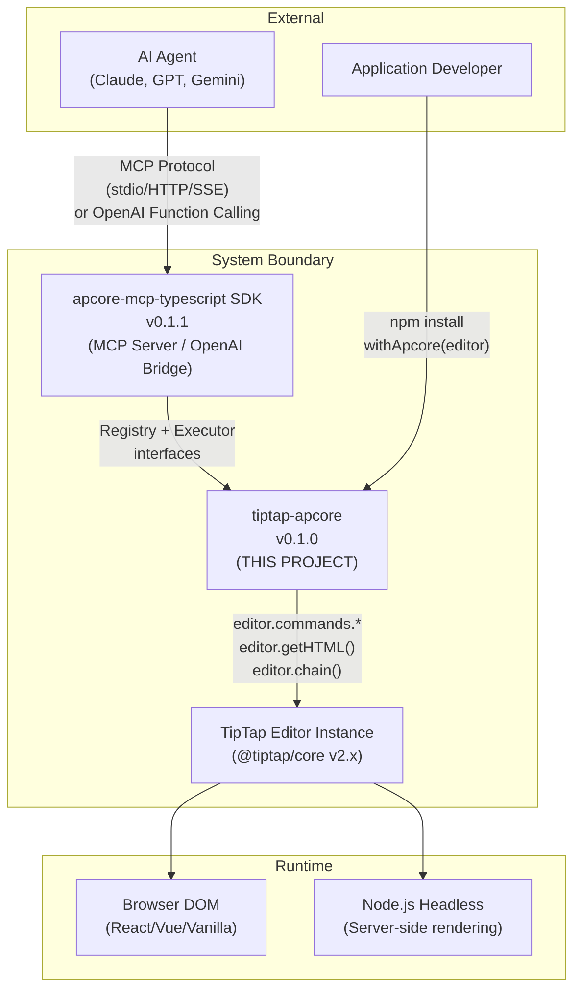
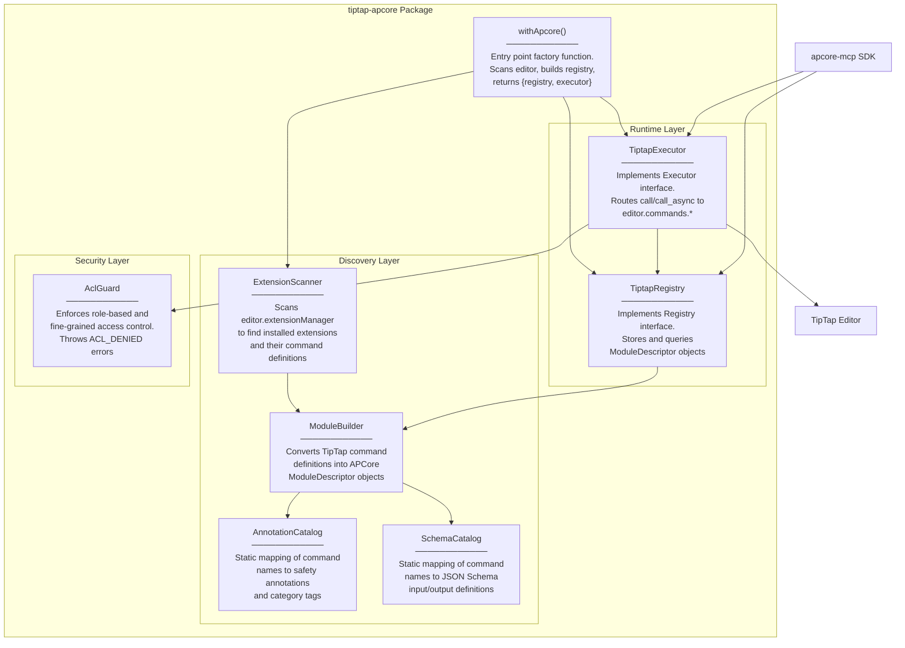
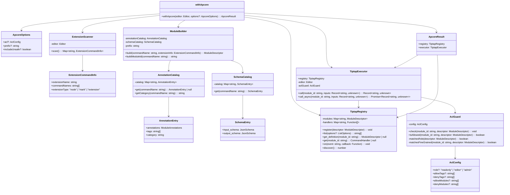
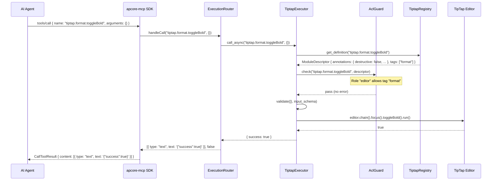
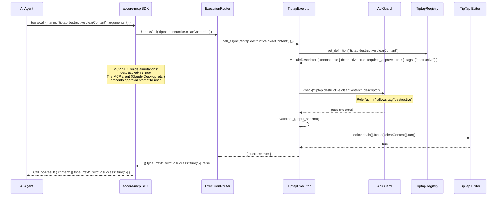
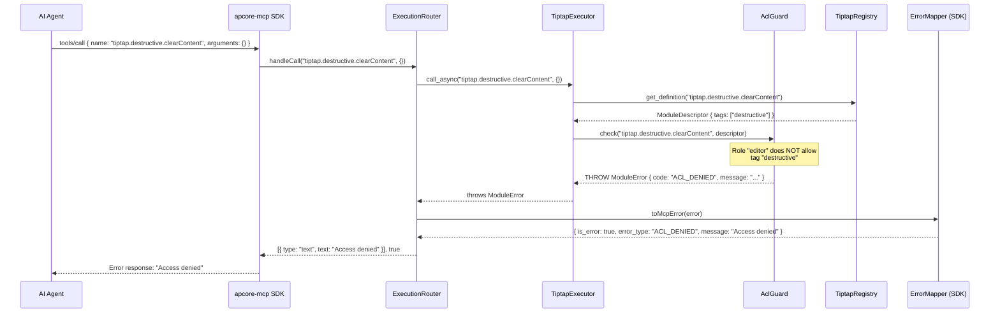

# Technical Design Document: tiptap-apcore

| Field        | Value                                                      |
|--------------|------------------------------------------------------------|
| **Title**    | tiptap-apcore: TipTap Editor APCore Module Library         |
| **Author**   | AIPartnerUp Engineering                                    |
| **Status**   | Draft                                                      |
| **Date**     | 2026-02-19                                                 |
| **Version**  | 0.1.0                                                      |
| **RFC**      | APCORE-RFC-002                                             |
| **Reviewers**| Core Team, APCore SDK maintainers                          |

---

## Table of Contents

1. [Overview / Abstract](#1-overview--abstract)
2. [Background & Motivation](#2-background--motivation)
3. [Goals & Non-Goals](#3-goals--non-goals)
4. [Proposed Design](#4-proposed-design)
5. [API Design](#5-api-design)
6. [Data Model](#6-data-model)
7. [Alternative Solutions](#7-alternative-solutions)
8. [Security Considerations](#8-security-considerations)
9. [Testing Strategy](#9-testing-strategy)
10. [Deployment & Packaging](#10-deployment--packaging)
11. [Performance Considerations](#11-performance-considerations)
12. [Migration & Compatibility](#12-migration--compatibility)
13. [Open Questions](#13-open-questions)
14. [References](#14-references)

---

## 1. Overview / Abstract

**tiptap-apcore** is a TypeScript library that wraps the TipTap rich text editor's command and query API as APCore modules, enabling AI agents to safely control TipTap editors via MCP (Model Context Protocol) or OpenAI function calling. It is the **first reference implementation** of the APCore universal AI-UI safety control framework.

The library provides a single entry point -- `withApcore(editor, options?)` -- that scans a TipTap `Editor` instance at runtime, auto-discovers all installed extensions and their commands, generates typed `ModuleDescriptor` objects with safety annotations (readonly, destructive, idempotent, requires_approval), and exposes a `Registry` + `Executor` pair that plugs directly into the existing `apcore-mcp-typescript` SDK. This design means an AI agent can read editor content, apply formatting, insert text, and perform destructive operations like `clearContent` -- all governed by role-based access control (ACL) that prevents unauthorized mutations.

---

## 2. Background & Motivation

### 2.1 Problem Statement

Modern AI agents (Claude, GPT, Gemini) can generate text, but they lack a safe, structured mechanism to **directly manipulate** rich text editors in user-facing applications. Current approaches fall into two problematic categories:

1. **Prompt-and-paste**: The AI generates markdown/HTML and the user manually pastes it into the editor. This breaks the editing workflow and loses document context.
2. **Unrestricted DOM manipulation**: Custom integrations give the AI full access to the editor API with no safety boundaries, no audit trail, and no way for the application to restrict which operations the AI may perform.

### 2.2 Why TipTap First?

TipTap was selected as the first APCore reference implementation for five reasons:

| Reason | Detail |
|--------|--------|
| **Immediate comprehension** | "AI writes articles" is a use case every developer and PM understands instantly |
| **Massive adoption** | 3.5M+ weekly npm downloads; large community |
| **Rich command surface** | 50+ core commands across query, format, content, destructive, and history categories -- ideal for showcasing APCore's scalability |
| **Intuitive safety annotations** | `clearContent` = destructive + requires_approval is self-evident to any developer |
| **Headless architecture** | TipTap's framework-agnostic, headless design means wrapping commands is clean -- no UI coupling |

### 2.3 Existing Infrastructure

The `apcore-mcp-typescript` SDK (v0.1.1) is already built and published. It provides:

- **`serve(executor, options?)`** -- Launch an MCP Server over stdio, HTTP, or SSE
- **`toOpenaiTools(executor, options?)`** -- Export OpenAI function calling definitions
- **`AnnotationMapper`** -- Maps `ModuleAnnotations` to MCP hint fields
- **`SchemaConverter`** -- Inlines `$ref` in JSON schemas for MCP compatibility
- **`ErrorMapper`** -- Sanitizes errors (e.g., `ACL_DENIED` -> "Access denied")
- **`ExecutionRouter`** -- Routes MCP tool calls to `executor.call_async()`

tiptap-apcore must implement the `Registry` and `Executor` interfaces defined in the SDK's `types.ts` -- nothing more, nothing less.

### 2.4 TipTap Editor Architecture

TipTap is a headless rich text editor framework built on ProseMirror. Key architectural points relevant to this design:

- **Commands** are accessed via `editor.commands.<commandName>(args)` and return `boolean` (success/failure)
- **Chainable commands** via `editor.chain().focus().<command>().run()` return `boolean`
- **Query methods** on the editor instance: `getHTML()`, `getJSON()`, `getText()`, `isActive()`, `getAttributes()`
- **Extension system**: `editor.extensionManager.extensions` exposes all installed extensions, each with `addCommands()` definitions
- **State access**: `editor.state` provides the ProseMirror EditorState; `editor.view` provides the EditorView
- Commands are synchronous (ProseMirror transactions are synchronous)

---

## 3. Goals & Non-Goals

### 3.1 Goals (V1 Scope)

| ID | Goal | Success Criteria |
|----|------|-----------------|
| G1 | Auto-discover TipTap commands from installed extensions at runtime | `withApcore(editor)` returns a registry containing all available commands without manual configuration |
| G2 | Generate typed `ModuleDescriptor` for every discovered command | Each descriptor has valid `input_schema`, `output_schema`, `annotations`, and `tags` |
| G3 | Implement `Registry` and `Executor` interfaces from `apcore-mcp-typescript` | `serve(executor)` and `toOpenaiTools(executor)` work out of the box |
| G4 | Provide role-based ACL with three presets: `readonly`, `editor`, `admin` | ACL-denied calls throw `ModuleError` with code `ACL_DENIED` |
| G5 | Support fine-grained ACL via allow/deny tags and module IDs | Developers can restrict access beyond role presets |
| G6 | Classify all ~54 TipTap core commands into 5 categories with correct annotations | Every module has accurate `readonly`, `destructive`, `idempotent`, `requires_approval`, `open_world` flags |
| G7 | Run in both browser and Node.js environments (isomorphic core) | Unit tests pass in both jsdom and Node.js |
| G8 | Ship a React + Vite demo application | Working demo that connects TipTap editor to Claude via MCP |

### 3.2 Non-Goals (Explicitly Out of Scope)

| ID | Non-Goal | Rationale |
|----|----------|-----------|
| NG1 | Custom TipTap extension development | tiptap-apcore wraps existing commands, not create new editor functionality |
| NG2 | Real-time collaborative editing (Yjs/Hocuspocus) support | Collaboration introduces CRDT conflict resolution that requires a separate design |
| NG3 | Undo/redo transaction grouping across multiple AI calls | ProseMirror history handles individual transactions; cross-call grouping is deferred |
| NG4 | Visual diff / change tracking UI | Out of scope for the core library; could be a separate extension |
| NG5 | Rate limiting or quota management | Application-level concern, not library-level |
| NG6 | Authentication / identity verification | tiptap-apcore receives an ACL config; it does not authenticate users |
| NG7 | Support for TipTap v1 | Only TipTap v2.x is supported |

---

## 4. Proposed Design

### 4.1 System Architecture

#### 4.1.1 C4 Context Diagram



#### 4.1.2 C4 Container Diagram



### 4.2 Component Design

#### 4.2.1 Component Responsibilities

| Component | Responsibility | Input | Output |
|-----------|---------------|-------|--------|
| **`withApcore()`** | Factory function. Orchestrates discovery, builds registry and executor, wires ACL | `Editor` instance + optional `ApcoreOptions` | `{ registry: TiptapRegistry, executor: TiptapExecutor }` |
| **`ExtensionScanner`** | Reads `editor.extensionManager.extensions` and extracts command function names from each extension's `addCommands()` return value | `Editor` instance | `Map<string, ExtensionCommandInfo>` -- extension name to command list |
| **`ModuleBuilder`** | Transforms a raw command name + extension info into a fully populated `ModuleDescriptor` | Command name, extension name, `AnnotationCatalog` entry, `SchemaCatalog` entry | `ModuleDescriptor` |
| **`AnnotationCatalog`** | Provides the static, curated mapping from TipTap command names to `ModuleAnnotations` and category tags | Command name (string) | `{ annotations: ModuleAnnotations, tags: string[], category: string }` or `null` for unknown commands |
| **`SchemaCatalog`** | Provides the static, curated mapping from TipTap command names to JSON Schema definitions for input and output | Command name (string) | `{ input_schema: JsonSchema, output_schema: JsonSchema }` |
| **`TiptapRegistry`** | Implements the APCore `Registry` interface. Stores `ModuleDescriptor` objects in a `Map`, supports list/filter by tags/prefix, emits events | - | Conforms to `Registry` |
| **`TiptapExecutor`** | Implements the APCore `Executor` interface. Resolves `module_id` to an editor command, validates inputs, checks ACL, executes, returns result | `module_id` + `inputs` | `Record<string, unknown>` result |
| **`AclGuard`** | Evaluates whether a given `module_id` is permitted under the current ACL configuration. Throws `ModuleError` with code `ACL_DENIED` on denial | `module_id`, `ModuleDescriptor`, `AclConfig` | `void` (pass) or throws |

#### 4.2.2 Class Diagram



### 4.3 Module Auto-Discovery

The auto-discovery mechanism scans the TipTap editor instance at initialization time to find all available commands from installed extensions.

#### 4.3.1 Discovery Algorithm

```
FUNCTION scan(editor: Editor) -> Map<string, ExtensionCommandInfo>:
    result = new Map()

    FOR each extension IN editor.extensionManager.extensions:
        extensionName = extension.name
        extensionType = extension.type  // "node" | "mark" | "extension"

        // TipTap extensions define commands via addCommands() which returns
        // an object where keys are command names and values are command factories
        commandObject = extension.options?.addCommands?.()
                        ?? extension.storage?.addCommands?.()

        // Fallback: check editor.commands for commands matching the extension
        IF commandObject is null:
            commandObject = extractFromEditorCommands(editor, extensionName)

        commandNames = Object.keys(commandObject ?? {})

        IF commandNames.length > 0:
            result.set(extensionName, {
                extensionName,
                commandNames,
                extensionType,
            })

    // Also discover built-in query methods
    result.set("__builtin__", {
        extensionName: "__builtin__",
        commandNames: ["getHTML", "getJSON", "getText", "isActive", "getAttributes",
                        "isEmpty", "isFocused", "isEditable"],
        extensionType: "extension",
    })

    RETURN result
```

#### 4.3.2 Discovery Scope

The scanner considers three sources of commands:

1. **Extension-defined commands** -- from `extension.addCommands()` return value (most common path)
2. **Editor-level commands** -- commands available on `editor.commands` that are contributed by core ProseMirror integration
3. **Built-in query methods** -- read-only methods on the `Editor` instance itself (`getHTML`, `getJSON`, `getText`, `isActive`, `getAttributes`, etc.)

#### 4.3.3 Unknown Command Handling

When the scanner discovers a command that is not in the `AnnotationCatalog` (e.g., a custom extension command), the following policy applies:

- **Default annotations**: `{ readonly: false, destructive: false, idempotent: false, requires_approval: false, open_world: false }`
- **Default tags**: `["unknown"]`
- **Default input_schema**: `{ type: "object", properties: {}, additionalProperties: true }` (open schema)
- **Default output_schema**: `{ type: "object", properties: { success: { type: "boolean" } } }`
- The command is registered unless `options.includeUnsafe` is explicitly `false` (default: `true`)
- A console warning is emitted: `"[tiptap-apcore] Unknown command '<name>' from extension '<ext>' registered with default annotations"`

### 4.4 Module Descriptor Generation

Each TipTap command is transformed into a `ModuleDescriptor` using the `ModuleBuilder`.

#### 4.4.1 Module ID Convention

Module IDs follow the pattern: `tiptap.<category>.<commandName>`

Examples:
- `tiptap.query.getHTML`
- `tiptap.format.toggleBold`
- `tiptap.content.insertContent`
- `tiptap.destructive.clearContent`
- `tiptap.history.undo`

If a custom prefix is provided via `options.prefix`, it replaces `tiptap`:
- `myapp.query.getHTML`

#### 4.4.2 Descriptor Generation Flow

```
FUNCTION build(commandName, extensionInfo) -> ModuleDescriptor:
    annotationEntry = annotationCatalog.get(commandName)  // may be null
    schemaEntry = schemaCatalog.get(commandName)           // has defaults

    IF annotationEntry is null:
        annotationEntry = DEFAULT_ANNOTATION_ENTRY
        WARN("Unknown command registered with defaults")

    module_id = buildModuleId(commandName)  // "tiptap.<category>.<commandName>"

    RETURN {
        module_id,
        name: commandName,
        description: generateDescription(commandName, extensionInfo, annotationEntry),
        input_schema: schemaEntry.input_schema,
        output_schema: schemaEntry.output_schema,
        annotations: annotationEntry.annotations,
        tags: annotationEntry.tags,
        version: "0.1.0",
        documentation: `https://tiptap.dev/docs/editor/api/commands/${commandName}`,
        examples: generateExamples(commandName, schemaEntry),
    }
```

### 4.5 Executor Implementation

#### 4.5.1 Command Execution Flow

The `TiptapExecutor` implements both `call()` (synchronous) and `call_async()` (asynchronous). Since TipTap commands are synchronous (ProseMirror transactions), `call_async` simply wraps `call` in a resolved Promise.

```
FUNCTION call(module_id, inputs) -> Record<string, unknown>:
    // 1. Resolve descriptor
    descriptor = registry.get_definition(module_id)
    IF descriptor is null:
        THROW ModuleError { code: "MODULE_NOT_FOUND", message: "Module '<module_id>' not found" }

    // 2. ACL check
    aclGuard.check(module_id, descriptor)  // throws ACL_DENIED

    // 3. Input validation
    validate(inputs, descriptor.input_schema)  // throws SCHEMA_VALIDATION_ERROR

    // 4. Route to appropriate handler
    category = extractCategory(module_id)  // "query" | "format" | "content" | "destructive" | "history"

    IF category == "query":
        RETURN executeQuery(module_id, inputs)
    ELSE:
        RETURN executeCommand(module_id, inputs)

FUNCTION executeQuery(module_id, inputs) -> Record<string, unknown>:
    commandName = extractCommandName(module_id)

    SWITCH commandName:
        CASE "getHTML":
            RETURN { html: editor.getHTML() }
        CASE "getJSON":
            RETURN { json: editor.getJSON() }
        CASE "getText":
            options = {}
            IF inputs.blockSeparator:
                options.blockSeparator = inputs.blockSeparator
            RETURN { text: editor.getText(options) }
        CASE "isActive":
            RETURN { active: editor.isActive(inputs.name, inputs.attrs ?? {}) }
        CASE "getAttributes":
            RETURN { attributes: editor.getAttributes(inputs.typeOrName) }
        ...

FUNCTION executeCommand(module_id, inputs) -> Record<string, unknown>:
    commandName = extractCommandName(module_id)
    commandFn = editor.commands[commandName]

    IF commandFn is undefined:
        THROW ModuleError { code: "COMMAND_NOT_FOUND" }

    // Execute via chain for focus management
    success = editor.chain().focus()[commandName](...spreadArgs(inputs)).run()

    RETURN { success }
```

#### 4.5.2 Sequence Diagram: Safe Command (toggleBold)



#### 4.5.3 Sequence Diagram: Destructive Command with Approval Flow (clearContent)



#### 4.5.4 Sequence Diagram: ACL Denied Command



### 4.6 ACL System

#### 4.6.1 Role Presets

| Role | Allowed Tags | Description |
|------|-------------|-------------|
| `readonly` | `["query"]` | Can only read editor content. Cannot modify, format, or delete |
| `editor` | `["query", "format", "content", "history"]` | Can read, format, insert content, and use undo/redo. Cannot perform destructive operations |
| `admin` | `["query", "format", "content", "destructive", "history"]` | Full access to all commands including destructive operations |

#### 4.6.2 ACL Evaluation Order

The `AclGuard` evaluates access in the following order (first match wins):

```
1. IF denyModules contains module_id         -> DENY
2. IF allowModules is set AND contains module_id -> ALLOW
3. IF denyTags overlaps with descriptor.tags  -> DENY
4. IF allowTags is set AND overlaps with descriptor.tags -> ALLOW
5. IF role is set:
   a. Resolve role to its allowed tags set
   b. IF descriptor.tags overlaps with role's allowed tags -> ALLOW
   c. ELSE -> DENY
6. IF no role and no allow lists -> ALLOW (permissive default)
```

The evaluation order ensures that explicit deny rules always take precedence, followed by explicit allow rules, followed by role-based rules. When no ACL config is provided at all, all commands are permitted (opt-in security model).

#### 4.6.3 ACL Error Format

When access is denied, the `AclGuard` throws:

```typescript
{
  name: "ModuleError",
  code: "ACL_DENIED",
  message: "Access denied: module 'tiptap.destructive.clearContent' is not permitted for role 'editor'",
  details: {
    module_id: "tiptap.destructive.clearContent",
    role: "editor",
    tags: ["destructive"],
    reason: "tag 'destructive' is not in allowed tags for role 'editor'"
  }
}
```

The SDK's `ErrorMapper` sanitizes this to just `"Access denied"` before it reaches the AI agent, preventing information leakage.

### 4.7 Error Handling

#### 4.7.1 Error Code Catalog

| Error Code | HTTP Analog | Trigger | Message Template | Details |
|------------|-------------|---------|-----------------|---------|
| `MODULE_NOT_FOUND` | 404 | `module_id` not in registry | `"Module '{module_id}' not found"` | `{ module_id }` |
| `COMMAND_NOT_FOUND` | 404 | Command exists in registry but not on `editor.commands` (extension was removed after discovery) | `"Command '{commandName}' not available on editor"` | `{ module_id, commandName }` |
| `SCHEMA_VALIDATION_ERROR` | 400 | Input does not match `input_schema` | `"Schema validation failed"` | `{ errors: [{ field, message, constraint }] }` |
| `ACL_DENIED` | 403 | ACL check fails | `"Access denied: module '{module_id}' is not permitted for role '{role}'"` | `{ module_id, role, tags, reason }` |
| `EDITOR_NOT_READY` | 503 | Editor is destroyed or not yet initialized | `"Editor is not ready"` | `{ editorDestroyed: boolean }` |
| `COMMAND_FAILED` | 500 | `editor.commands.*` returns `false` | `"Command '{commandName}' failed"` | `{ module_id, commandName }` |
| `INTERNAL_ERROR` | 500 | Unexpected exception during execution | `"Internal error occurred"` | `null` (sanitized) |

#### 4.7.2 Error Class

```typescript
class TiptapModuleError extends Error {
  readonly code: string;
  readonly details: Record<string, unknown> | null;

  constructor(code: string, message: string, details?: Record<string, unknown>) {
    super(message);
    this.name = "ModuleError";  // SDK checks this name
    this.code = code;
    this.details = details ?? null;
  }
}
```

---

## 5. API Design

### 5.1 `withApcore(editor, options?)`

The primary entry point. Creates a registry and executor pair from a TipTap editor instance.

#### Signature

```typescript
function withApcore(editor: Editor, options?: ApcoreOptions): ApcoreResult;
```

#### Parameters

| Parameter | Type | Required | Default | Constraints | Description |
|-----------|------|----------|---------|-------------|-------------|
| `editor` | `Editor` | Yes | -- | Must be a valid TipTap `Editor` instance. Must not be destroyed (`editor.isDestroyed === false`). Must have at least one extension installed (`editor.extensionManager.extensions.length >= 1`). Throws `EDITOR_NOT_READY` if violated. | The TipTap editor instance to wrap |
| `options` | `ApcoreOptions` | No | `{}` | Must be a plain object if provided. | Configuration options |

#### `ApcoreOptions` Fields

| Field | Type | Required | Default | Constraints | Description |
|-------|------|----------|---------|-------------|-------------|
| `acl` | `AclConfig` | No | `undefined` (all commands allowed) | Must conform to `AclConfig` schema. If `role` is provided, must be one of `"readonly"`, `"editor"`, `"admin"`. `allowTags` and `denyTags` entries must be non-empty strings. `allowModules` and `denyModules` entries must match module ID pattern `/^[a-z][a-z0-9]*(\.[a-z][a-zA-Z0-9]*)+$/`. | Access control configuration |
| `prefix` | `string` | No | `"tiptap"` | Must match `/^[a-z][a-z0-9]*$/` (1-32 lowercase alphanumeric characters). | Module ID prefix (replaces `"tiptap"` in `tiptap.category.command`) |
| `includeUnsafe` | `boolean` | No | `true` | Must be boolean. | Whether to include commands not found in the AnnotationCatalog (registered with default annotations) |

#### `AclConfig` Fields

| Field | Type | Required | Default | Constraints | Description |
|-------|------|----------|---------|-------------|-------------|
| `role` | `"readonly" \| "editor" \| "admin"` | No | `undefined` | Must be one of the three literal strings if provided. Mutually exclusive intent with `allowTags` (both can be set, but `allowTags` takes precedence over role resolution). | Preset access role |
| `allowTags` | `string[]` | No | `undefined` | Each entry must be a non-empty string. Valid built-in tags: `"query"`, `"format"`, `"content"`, `"destructive"`, `"history"`, `"unknown"`. Custom tags are also accepted. Array must not exceed 100 entries. | Tags to explicitly allow |
| `denyTags` | `string[]` | No | `undefined` | Same constraints as `allowTags`. | Tags to explicitly deny (takes precedence over allow) |
| `allowModules` | `string[]` | No | `undefined` | Each entry must match module ID pattern. Array must not exceed 500 entries. | Module IDs to explicitly allow |
| `denyModules` | `string[]` | No | `undefined` | Same constraints as `allowModules`. | Module IDs to explicitly deny (takes precedence over allow) |

#### Return Value: `ApcoreResult`

```typescript
interface ApcoreResult {
  /** APCore Registry containing all discovered module descriptors */
  registry: TiptapRegistry;
  /** APCore Executor that routes calls to editor commands */
  executor: TiptapExecutor;
}
```

#### Example

```typescript
import { Editor } from '@tiptap/core';
import StarterKit from '@tiptap/starter-kit';
import { withApcore } from 'tiptap-apcore';

const editor = new Editor({
  extensions: [StarterKit],
  content: '<p>Hello world</p>',
});

// Basic usage -- all commands, no ACL
const { registry, executor } = withApcore(editor);
console.log(registry.list()); // ["tiptap.query.getHTML", "tiptap.format.toggleBold", ...]

// With ACL -- editor role
const { executor: safeExecutor } = withApcore(editor, {
  acl: { role: 'editor' },
});

// With fine-grained ACL
const { executor: customExecutor } = withApcore(editor, {
  acl: {
    role: 'editor',
    denyModules: ['tiptap.content.insertContent'],  // block specific command
  },
});

// With custom prefix
const { registry: customRegistry } = withApcore(editor, {
  prefix: 'myapp',
});
console.log(customRegistry.list()); // ["myapp.query.getHTML", "myapp.format.toggleBold", ...]
```

#### Error Cases

| Condition | Error Code | Example |
|-----------|------------|---------|
| `editor` is `null`/`undefined` | `TypeError` | `withApcore(null)` |
| `editor.isDestroyed === true` | `EDITOR_NOT_READY` | Editor was destroyed before `withApcore` call |
| `options.acl.role` is invalid string | `SCHEMA_VALIDATION_ERROR` | `withApcore(editor, { acl: { role: 'superadmin' } })` |
| `options.prefix` contains invalid characters | `SCHEMA_VALIDATION_ERROR` | `withApcore(editor, { prefix: 'My-App' })` |

---

### 5.2 `TiptapRegistry` Class

Implements the APCore `Registry` interface.

#### `list(options?)`

Returns an array of all registered module IDs, optionally filtered.

```typescript
list(options?: { tags?: string[] | null; prefix?: string | null }): string[];
```

| Parameter | Type | Required | Default | Constraints | Description |
|-----------|------|----------|---------|-------------|-------------|
| `options.tags` | `string[] \| null` | No | `null` | Each tag must be a non-empty string. If provided, returns only modules whose tags intersect with the given tags (OR logic). | Filter by tags |
| `options.prefix` | `string \| null` | No | `null` | Must be a non-empty string if provided. Matched via `module_id.startsWith(prefix)`. | Filter by module ID prefix |

**Example:**

```typescript
// All modules
registry.list();
// => ["tiptap.query.getHTML", "tiptap.query.getJSON", "tiptap.format.toggleBold", ...]

// Only query modules
registry.list({ tags: ["query"] });
// => ["tiptap.query.getHTML", "tiptap.query.getJSON", "tiptap.query.getText", ...]

// By prefix
registry.list({ prefix: "tiptap.format" });
// => ["tiptap.format.toggleBold", "tiptap.format.toggleItalic", ...]

// Both filters (AND logic between tags and prefix)
registry.list({ tags: ["format"], prefix: "tiptap.format.toggle" });
// => ["tiptap.format.toggleBold", "tiptap.format.toggleItalic", ...]
```

#### `get_definition(module_id)`

Returns the full `ModuleDescriptor` for a given module ID.

```typescript
get_definition(module_id: string): ModuleDescriptor | null;
```

| Parameter | Type | Required | Constraints | Description |
|-----------|------|----------|-------------|-------------|
| `module_id` | `string` | Yes | Non-empty string. | The module ID to look up |

**Returns:** `ModuleDescriptor` if found, `null` if not found.

**Example:**

```typescript
const desc = registry.get_definition("tiptap.format.toggleBold");
// => {
//   module_id: "tiptap.format.toggleBold",
//   name: "toggleBold",
//   description: "Toggle bold formatting on the current selection...",
//   input_schema: { type: "object", properties: {} },
//   output_schema: { type: "object", properties: { success: { type: "boolean" } } },
//   annotations: { readonly: false, destructive: false, idempotent: true,
//                   requires_approval: false, open_world: false },
//   tags: ["format"],
//   version: "0.1.0",
// }

registry.get_definition("nonexistent.module");
// => null
```

#### `get(module_id)`

Returns the command handler function for a given module ID.

```typescript
get(module_id: string): CommandHandler | null;
```

**Returns:** A function reference if the module is registered, `null` otherwise. This is used internally by the executor.

#### `on(event, callback)`

Register an event listener.

```typescript
on(event: string, callback: (...args: unknown[]) => void): void;
```

| Parameter | Type | Required | Constraints | Description |
|-----------|------|----------|-------------|-------------|
| `event` | `string` | Yes | Supported events: `"module:registered"`, `"module:removed"`, `"discover:complete"`. Other event names are silently accepted but never fired. | Event name |
| `callback` | `Function` | Yes | Must be callable. | Event handler |

**Events:**

| Event | Payload | Trigger |
|-------|---------|---------|
| `module:registered` | `{ module_id: string, descriptor: ModuleDescriptor }` | A new module is registered in the registry |
| `module:removed` | `{ module_id: string }` | A module is removed from the registry |
| `discover:complete` | `{ count: number, modules: string[] }` | Discovery scan completes |

#### `discover()`

Re-scans the editor instance and updates the registry. Returns the number of modules discovered.

```typescript
discover(): number;
```

**Example:**

```typescript
// Initial setup discovers 42 modules
const { registry } = withApcore(editor);
console.log(registry.list().length); // 42

// User installs a new TipTap extension at runtime
editor.extensionManager.extensions.push(newExtension);

// Re-discover to pick up new commands
const count = registry.discover();
console.log(count); // 45 (3 new commands from the extension)
```

---

### 5.3 `TiptapExecutor` Class

Implements the APCore `Executor` interface.

#### `call(module_id, inputs)`

Synchronous execution of a module.

```typescript
call(module_id: string, inputs: Record<string, unknown>): Record<string, unknown>;
```

| Parameter | Type | Required | Constraints | Description |
|-----------|------|----------|-------------|-------------|
| `module_id` | `string` | Yes | Non-empty string. Must exist in registry (else `MODULE_NOT_FOUND`). | The module to execute |
| `inputs` | `Record<string, unknown>` | Yes | Must be a plain object. Must validate against the module's `input_schema` (else `SCHEMA_VALIDATION_ERROR`). | Input parameters |

**Return:** `Record<string, unknown>` containing the execution result.

**Example:**

```typescript
// Query command
const result = executor.call("tiptap.query.getHTML", {});
// => { html: "<p>Hello world</p>" }

// Format command
const result2 = executor.call("tiptap.format.toggleBold", {});
// => { success: true }

// Content command with parameters
const result3 = executor.call("tiptap.content.insertContent", {
  value: "<p>New paragraph</p>",
});
// => { success: true }
```

#### `call_async(module_id, inputs)`

Asynchronous execution (wraps `call` in a Promise since TipTap commands are synchronous).

```typescript
call_async(module_id: string, inputs: Record<string, unknown>): Promise<Record<string, unknown>>;
```

Parameters and return are identical to `call()`, but wrapped in `Promise`.

---

### 5.4 Input/Output Schema Examples by Category

#### Query: `tiptap.query.getHTML`

**Input:**
```json
{
  "type": "object",
  "properties": {},
  "required": [],
  "additionalProperties": false
}
```

**Output:**
```json
{
  "type": "object",
  "properties": {
    "html": { "type": "string", "description": "The editor content as an HTML string" }
  },
  "required": ["html"]
}
```

**Call example:**
```typescript
executor.call("tiptap.query.getHTML", {})
// => { html: "<p>Hello <strong>world</strong></p>" }
```

#### Query: `tiptap.query.isActive`

**Input:**
```json
{
  "type": "object",
  "properties": {
    "name": {
      "type": "string",
      "description": "Name of the node or mark to check (e.g., 'bold', 'heading', 'link')",
      "minLength": 1,
      "maxLength": 100
    },
    "attrs": {
      "type": "object",
      "description": "Optional attributes to match (e.g., { level: 2 } for heading)",
      "additionalProperties": true,
      "default": {}
    }
  },
  "required": ["name"],
  "additionalProperties": false
}
```

**Output:**
```json
{
  "type": "object",
  "properties": {
    "active": { "type": "boolean", "description": "Whether the node/mark is currently active" }
  },
  "required": ["active"]
}
```

**Call example:**
```typescript
executor.call("tiptap.query.isActive", { name: "heading", attrs: { level: 2 } })
// => { active: true }
```

#### Format: `tiptap.format.toggleHeading`

**Input:**
```json
{
  "type": "object",
  "properties": {
    "level": {
      "type": "integer",
      "description": "Heading level (1-6)",
      "minimum": 1,
      "maximum": 6
    }
  },
  "required": ["level"],
  "additionalProperties": false
}
```

**Output:**
```json
{
  "type": "object",
  "properties": {
    "success": { "type": "boolean" }
  },
  "required": ["success"]
}
```

**Call example:**
```typescript
executor.call("tiptap.format.toggleHeading", { level: 2 })
// => { success: true }
```

#### Content: `tiptap.content.insertContent`

**Input:**
```json
{
  "type": "object",
  "properties": {
    "value": {
      "oneOf": [
        { "type": "string", "description": "HTML or plain text content to insert" },
        { "type": "object", "description": "ProseMirror JSON node to insert" },
        {
          "type": "array",
          "items": { "type": "object" },
          "description": "Array of ProseMirror JSON nodes to insert"
        }
      ],
      "description": "Content to insert. Accepts HTML string, plain text, or ProseMirror JSON node(s)"
    },
    "options": {
      "type": "object",
      "properties": {
        "parseOptions": {
          "type": "object",
          "properties": {
            "preserveWhitespace": {
              "type": "boolean",
              "default": true,
              "description": "Whether to preserve whitespace when parsing HTML"
            }
          },
          "additionalProperties": false
        },
        "updateSelection": {
          "type": "boolean",
          "default": true,
          "description": "Whether to update the selection after inserting"
        }
      },
      "additionalProperties": false
    }
  },
  "required": ["value"],
  "additionalProperties": false
}
```

**Output:**
```json
{
  "type": "object",
  "properties": {
    "success": { "type": "boolean" }
  },
  "required": ["success"]
}
```

**Call example:**
```typescript
executor.call("tiptap.content.insertContent", {
  value: "<h2>New Section</h2><p>Content here</p>",
})
// => { success: true }
```

#### Destructive: `tiptap.destructive.setContent`

**Input:**
```json
{
  "type": "object",
  "properties": {
    "value": {
      "oneOf": [
        { "type": "string", "description": "HTML or plain text content" },
        { "type": "object", "description": "ProseMirror JSON document" }
      ],
      "description": "Content to replace the entire document with"
    },
    "emitUpdate": {
      "type": "boolean",
      "default": true,
      "description": "Whether to emit an update event after setting content"
    },
    "parseOptions": {
      "type": "object",
      "properties": {
        "preserveWhitespace": {
          "type": "boolean",
          "default": true
        }
      },
      "additionalProperties": false,
      "description": "HTML parse options"
    }
  },
  "required": ["value"],
  "additionalProperties": false
}
```

**Output:**
```json
{
  "type": "object",
  "properties": {
    "success": { "type": "boolean" }
  },
  "required": ["success"]
}
```

**Call example:**
```typescript
executor.call("tiptap.destructive.setContent", {
  value: "<p>Completely new content</p>",
  emitUpdate: true,
})
// => { success: true }
```

---

## 6. Data Model

### 6.1 Module ID Naming Convention

```
<prefix>.<category>.<commandName>

prefix      = "tiptap" (default) or custom string matching /^[a-z][a-z0-9]*$/
category    = "query" | "format" | "content" | "destructive" | "history"
commandName = camelCase TipTap command name (e.g., "toggleBold", "getHTML")
```

**Rules:**
1. Module IDs are globally unique within a registry
2. The `commandName` portion preserves the exact TipTap API name (camelCase)
3. Category is determined by the `AnnotationCatalog`, not inferred from the command name
4. Unknown commands get category `"unknown"` and module ID `<prefix>.unknown.<commandName>`

### 6.2 Annotation Mapping Rules

| TipTap Command Characteristic | `readonly` | `destructive` | `idempotent` | `requires_approval` | `open_world` |
|-------------------------------|:----------:|:-------------:|:------------:|:-------------------:|:------------:|
| Returns data without mutation (getHTML, getText, isActive) | `true` | `false` | `true` | `false` | `false` |
| Toggles formatting (toggleBold, toggleItalic) | `false` | `false` | `true` | `false` | `false` |
| Inserts/modifies content (insertContent, updateAttributes) | `false` | `false` | `false` | `false` | `false` |
| Replaces/deletes content (clearContent, setContent, deleteSelection) | `false` | `true` | `false` | `true` | `false` |
| Undo/redo (undo, redo) | `false` | `false` | `false` | `false` | `false` |

**Why `open_world` is always `false`:** TipTap editors operate on an in-memory document. They do not make external network calls, access file systems, or interact with resources outside the editor's ProseMirror state. All operations are closed-world by definition.

**Why toggle commands are `idempotent: true`:** While a toggle changes state, calling it twice returns to the original state. The MCP spec defines idempotent as "calling with the same arguments has no additional effect" -- from the perspective of a single call, a toggle either applies or removes the formatting, and the same call with the same selection state produces the same result.

### 6.3 Complete Module Catalog

The following table lists all ~54 TipTap modules that tiptap-apcore registers. This covers TipTap's core commands plus common extensions from `@tiptap/starter-kit`.

#### 6.3.1 Query Modules

| # | module_id | Command | Description | Input Schema Summary | readonly | destructive | idempotent | requires_approval | open_world | Tags |
|---|-----------|---------|-------------|---------------------|:--------:|:-----------:|:----------:|:-----------------:|:----------:|------|
| 1 | `tiptap.query.getHTML` | `getHTML` | Get editor content as HTML string | `{}` (no params) | true | false | true | false | false | query |
| 2 | `tiptap.query.getJSON` | `getJSON` | Get editor content as ProseMirror JSON | `{}` (no params) | true | false | true | false | false | query |
| 3 | `tiptap.query.getText` | `getText` | Get editor content as plain text | `{ blockSeparator?: string }` | true | false | true | false | false | query |
| 4 | `tiptap.query.isActive` | `isActive` | Check if a node or mark is active in selection | `{ name: string, attrs?: object }` | true | false | true | false | false | query |
| 5 | `tiptap.query.getAttributes` | `getAttributes` | Get attributes of active node or mark | `{ typeOrName: string }` | true | false | true | false | false | query |
| 6 | `tiptap.query.isEmpty` | `isEmpty` | Check if the document is empty | `{}` (no params) | true | false | true | false | false | query |
| 7 | `tiptap.query.isEditable` | `isEditable` | Check if the editor is in editable mode | `{}` (no params) | true | false | true | false | false | query |
| 8 | `tiptap.query.isFocused` | `isFocused` | Check if the editor is currently focused | `{}` (no params) | true | false | true | false | false | query |
| 9 | `tiptap.query.getCharacterCount` | `getCharacterCount` | Get the character count of the document | `{}` (no params) | true | false | true | false | false | query |
| 10 | `tiptap.query.getWordCount` | `getWordCount` | Get the word count of the document | `{}` (no params) | true | false | true | false | false | query |

#### 6.3.2 Format Modules

| # | module_id | Command | Description | Input Schema Summary | readonly | destructive | idempotent | requires_approval | open_world | Tags |
|---|-----------|---------|-------------|---------------------|:--------:|:-----------:|:----------:|:-----------------:|:----------:|------|
| 11 | `tiptap.format.toggleBold` | `toggleBold` | Toggle bold mark on current selection | `{}` | false | false | true | false | false | format |
| 12 | `tiptap.format.toggleItalic` | `toggleItalic` | Toggle italic mark on current selection | `{}` | false | false | true | false | false | format |
| 13 | `tiptap.format.toggleStrike` | `toggleStrike` | Toggle strikethrough mark on current selection | `{}` | false | false | true | false | false | format |
| 14 | `tiptap.format.toggleCode` | `toggleCode` | Toggle inline code mark on current selection | `{}` | false | false | true | false | false | format |
| 15 | `tiptap.format.toggleUnderline` | `toggleUnderline` | Toggle underline mark on current selection | `{}` | false | false | true | false | false | format |
| 16 | `tiptap.format.toggleSubscript` | `toggleSubscript` | Toggle subscript mark on current selection | `{}` | false | false | true | false | false | format |
| 17 | `tiptap.format.toggleSuperscript` | `toggleSuperscript` | Toggle superscript mark on current selection | `{}` | false | false | true | false | false | format |
| 18 | `tiptap.format.toggleHighlight` | `toggleHighlight` | Toggle highlight mark on current selection | `{ color?: string }` | false | false | true | false | false | format |
| 19 | `tiptap.format.toggleHeading` | `toggleHeading` | Toggle heading node with given level | `{ level: integer [1-6] }` | false | false | true | false | false | format |
| 20 | `tiptap.format.toggleBulletList` | `toggleBulletList` | Toggle bullet (unordered) list | `{}` | false | false | true | false | false | format |
| 21 | `tiptap.format.toggleOrderedList` | `toggleOrderedList` | Toggle ordered (numbered) list | `{}` | false | false | true | false | false | format |
| 22 | `tiptap.format.toggleTaskList` | `toggleTaskList` | Toggle task/checkbox list | `{}` | false | false | true | false | false | format |
| 23 | `tiptap.format.toggleCodeBlock` | `toggleCodeBlock` | Toggle code block with optional language | `{ language?: string }` | false | false | true | false | false | format |
| 24 | `tiptap.format.toggleBlockquote` | `toggleBlockquote` | Toggle blockquote wrapping | `{}` | false | false | true | false | false | format |
| 25 | `tiptap.format.setTextAlign` | `setTextAlign` | Set text alignment for current block | `{ alignment: "left"\|"center"\|"right"\|"justify" }` | false | false | true | false | false | format |
| 26 | `tiptap.format.setMark` | `setMark` | Set a specific mark with optional attributes | `{ typeOrName: string, attrs?: object }` | false | false | true | false | false | format |
| 27 | `tiptap.format.unsetMark` | `unsetMark` | Remove a specific mark from selection | `{ typeOrName: string }` | false | false | true | false | false | format |
| 28 | `tiptap.format.unsetAllMarks` | `unsetAllMarks` | Remove all marks from current selection | `{}` | false | false | true | false | false | format |
| 29 | `tiptap.format.clearNodes` | `clearNodes` | Reset selected nodes to paragraph type | `{}` | false | false | true | false | false | format |
| 30 | `tiptap.format.setHardBreak` | `setHardBreak` | Insert a hard line break (br) | `{}` | false | false | false | false | false | format |
| 31 | `tiptap.format.setHorizontalRule` | `setHorizontalRule` | Insert a horizontal rule (hr) | `{}` | false | false | false | false | false | format |
| 32 | `tiptap.format.updateAttributes` | `updateAttributes` | Update attributes of the selected node or mark | `{ typeOrName: string, attrs: object }` | false | false | true | false | false | format |
| 33 | `tiptap.format.setLink` | `setLink` | Set a link mark on the current selection | `{ href: string, target?: string, rel?: string }` | false | false | true | false | false | format |
| 34 | `tiptap.format.unsetLink` | `unsetLink` | Remove link mark from the current selection | `{}` | false | false | true | false | false | format |

#### 6.3.3 Content Modules

| # | module_id | Command | Description | Input Schema Summary | readonly | destructive | idempotent | requires_approval | open_world | Tags |
|---|-----------|---------|-------------|---------------------|:--------:|:-----------:|:----------:|:-----------------:|:----------:|------|
| 35 | `tiptap.content.insertContent` | `insertContent` | Insert content at the current cursor position | `{ value: string\|object\|array, options?: object }` | false | false | false | false | false | content |
| 36 | `tiptap.content.insertContentAt` | `insertContentAt` | Insert content at a specific document position | `{ position: integer [0-], value: string\|object\|array, options?: object }` | false | false | false | false | false | content |
| 37 | `tiptap.content.setNode` | `setNode` | Convert the current block to a specific node type | `{ typeOrName: string, attrs?: object }` | false | false | false | false | false | content |
| 38 | `tiptap.content.splitBlock` | `splitBlock` | Split the current block into two at cursor | `{ keepMarks?: boolean }` | false | false | false | false | false | content |
| 39 | `tiptap.content.liftListItem` | `liftListItem` | Lift a list item out of its parent list | `{ typeOrName: string }` | false | false | false | false | false | content |
| 40 | `tiptap.content.sinkListItem` | `sinkListItem` | Sink a list item into a nested list | `{ typeOrName: string }` | false | false | false | false | false | content |
| 41 | `tiptap.content.wrapIn` | `wrapIn` | Wrap the selection in a given node type | `{ typeOrName: string, attrs?: object }` | false | false | false | false | false | content |
| 42 | `tiptap.content.joinBackward` | `joinBackward` | Join the current block with the previous one | `{}` | false | false | false | false | false | content |
| 43 | `tiptap.content.joinForward` | `joinForward` | Join the current block with the next one | `{}` | false | false | false | false | false | content |
| 44 | `tiptap.content.lift` | `lift` | Lift the selected block out of its parent | `{ typeOrName: string, attrs?: object }` | false | false | false | false | false | content |

#### 6.3.4 Destructive Modules

| # | module_id | Command | Description | Input Schema Summary | readonly | destructive | idempotent | requires_approval | open_world | Tags |
|---|-----------|---------|-------------|---------------------|:--------:|:-----------:|:----------:|:-----------------:|:----------:|------|
| 45 | `tiptap.destructive.clearContent` | `clearContent` | Remove all content from the editor | `{ emitUpdate?: boolean }` | false | true | false | true | false | destructive |
| 46 | `tiptap.destructive.setContent` | `setContent` | Replace the entire document content | `{ value: string\|object, emitUpdate?: boolean, parseOptions?: object }` | false | true | false | true | false | destructive |
| 47 | `tiptap.destructive.deleteSelection` | `deleteSelection` | Delete the currently selected content | `{}` | false | true | false | true | false | destructive |
| 48 | `tiptap.destructive.deleteRange` | `deleteRange` | Delete content within a specific position range | `{ from: integer [0-], to: integer [0-] }` | false | true | false | true | false | destructive |
| 49 | `tiptap.destructive.deleteCurrentNode` | `deleteCurrentNode` | Delete the currently selected node | `{}` | false | true | false | true | false | destructive |
| 50 | `tiptap.destructive.cut` | `cut` | Cut selected content (delete from document) | `{}` | false | true | false | true | false | destructive |

#### 6.3.5 Selection Modules

| # | module_id | Command | Description | Input Schema Summary | readonly | destructive | idempotent | requires_approval | open_world | Tags |
|---|-----------|---------|-------------|---------------------|:--------:|:-----------:|:----------:|:-----------------:|:----------:|------|
| 51 | `tiptap.selection.setTextSelection` | `setTextSelection` | Set cursor/selection to a specific position or range | `{ position: integer\|{ from: integer, to: integer } }` | false | false | true | false | false | selection |
| 52 | `tiptap.selection.setNodeSelection` | `setNodeSelection` | Select the node at a given position | `{ position: integer [0-] }` | false | false | true | false | false | selection |
| 53 | `tiptap.selection.selectAll` | `selectAll` | Select the entire document content | `{}` | false | false | true | false | false | selection |
| 54 | `tiptap.selection.selectParentNode` | `selectParentNode` | Select the parent node of the current selection | `{}` | false | false | true | false | false | selection |
| 55 | `tiptap.selection.selectTextblockStart` | `selectTextblockStart` | Move cursor to the start of the current text block | `{}` | false | false | true | false | false | selection |
| 56 | `tiptap.selection.selectTextblockEnd` | `selectTextblockEnd` | Move cursor to the end of the current text block | `{}` | false | false | true | false | false | selection |
| 57 | `tiptap.selection.focus` | `focus` | Focus the editor, optionally at a position | `{ position?: "start"\|"end"\|"all"\|integer }` | false | false | true | false | false | selection |
| 58 | `tiptap.selection.blur` | `blur` | Remove focus from the editor | `{}` | false | false | true | false | false | selection |
| 59 | `tiptap.selection.scrollIntoView` | `scrollIntoView` | Scroll the editor view to the current selection | `{}` | false | false | true | false | false | selection |

#### 6.3.6 History Modules

| # | module_id | Command | Description | Input Schema Summary | readonly | destructive | idempotent | requires_approval | open_world | Tags |
|---|-----------|---------|-------------|---------------------|:--------:|:-----------:|:----------:|:-----------------:|:----------:|------|
| 60 | `tiptap.history.undo` | `undo` | Undo the last change | `{}` | false | false | false | false | false | history |
| 61 | `tiptap.history.redo` | `redo` | Redo the last undone change | `{}` | false | false | false | false | false | history |

**Total: 61 modules across 6 categories** (query: 10, format: 24, content: 10, destructive: 6, selection: 9, history: 2).

> **Note**: The "selection" category was added beyond the original 5 categories because selection manipulation commands (setTextSelection, selectAll, focus, blur) are neither query nor format -- they alter the editor's selection state without modifying document content. Selection modules use annotations: `readonly=false, destructive=false, idempotent=true, requires_approval=false, open_world=false`.

> **Note on ACL**: The `editor` role includes `["query", "format", "content", "history", "selection"]`. The `readonly` role includes `["query"]` only. The `admin` role includes all 6 tags.

---

## 7. Alternative Solutions

### 7.1 Alternative A: TipTap Extension Approach

**Description:** Instead of the `withApcore(editor)` wrapper pattern, implement tiptap-apcore as a native TipTap extension that registers itself via `editor.registerPlugin()` or the TipTap extension lifecycle.

```typescript
// Alternative A: Extension approach
import { Extension } from '@tiptap/core';

const ApcoreExtension = Extension.create({
  name: 'apcore',
  addOptions() {
    return { acl: { role: 'editor' } };
  },
  onCreate() {
    // Auto-discover commands from sibling extensions
    this.storage.registry = new TiptapRegistry();
    this.storage.executor = new TiptapExecutor(this.editor, ...);
    // Register all commands...
  },
  onDestroy() {
    this.storage.registry.clear();
  },
});

// Usage
const editor = new Editor({
  extensions: [StarterKit, ApcoreExtension.configure({ acl: { role: 'editor' } })],
});

const registry = editor.storage.apcore.registry;
const executor = editor.storage.apcore.executor;
```

**Pros:**
- Follows TipTap's native extension conventions; familiar to TipTap developers
- Automatically handles editor lifecycle (onCreate, onDestroy)
- Can tap into TipTap's `onUpdate` and `onTransaction` events for real-time module state updates
- Access to `this.editor` is guaranteed and managed by TipTap

**Cons:**
- Couples the APCore integration to TipTap's extension loading order; if `ApcoreExtension` loads before other extensions, it misses their commands
- Extension storage (`editor.storage.apcore`) is a weak contract -- no TypeScript interface enforcement
- Testing requires a full TipTap editor instance with the extension installed; cannot test the registry/executor in isolation
- Re-discovery requires extension reload, which TipTap does not support cleanly at runtime
- Harder to provide a clean TypeScript return type; consumers must cast from `editor.storage`

### 7.2 Alternative B: Manual Module Registration (No Auto-Discovery)

**Description:** Instead of auto-discovering commands, require developers to explicitly register each module they want to expose.

```typescript
// Alternative B: Manual registration
import { TiptapRegistry, TiptapExecutor, defineModule } from 'tiptap-apcore';

const registry = new TiptapRegistry();
const executor = new TiptapExecutor(editor, registry);

// Developer must register each module manually
registry.register(defineModule({
  command: 'toggleBold',
  category: 'format',
  annotations: { readonly: false, destructive: false, idempotent: true, requires_approval: false, open_world: false },
  inputSchema: { type: 'object', properties: {} },
}));

registry.register(defineModule({
  command: 'insertContent',
  category: 'content',
  annotations: { readonly: false, destructive: false, idempotent: false, requires_approval: false, open_world: false },
  inputSchema: { type: 'object', properties: { value: { type: 'string' } }, required: ['value'] },
}));

// ... repeat for every command
```

**Pros:**
- Complete control over which commands are exposed; no surprises from auto-discovery
- Schema and annotations are explicit and visible in the codebase; easier to audit
- No dependency on TipTap's internal extension structure; works even if `extensionManager` API changes
- Can define custom composite commands (e.g., "formatAsTitle" = selectAll + toggleHeading)

**Cons:**
- Extremely verbose; registering 50+ commands manually is tedious and error-prone
- Every new TipTap extension requires manual module definitions; poor scalability
- Schema definitions must be kept in sync with TipTap API changes manually
- Defeats the "plug-and-play" developer experience that APCore targets
- First-time setup is 200+ lines of boilerplate for a standard configuration

### 7.3 Comparison Matrix

| Criterion | **Proposed: withApcore() wrapper** | **Alt A: TipTap Extension** | **Alt B: Manual Registration** |
|-----------|:---:|:---:|:---:|
| **Setup complexity** | 1 line (`withApcore(editor)`) | 3 lines (add to extensions array + extract from storage) | 50+ lines (one per module) |
| **TypeScript ergonomics** | Excellent -- returns typed `{ registry, executor }` | Poor -- must cast from `editor.storage` | Good -- explicit types |
| **Auto-discovery** | Yes -- scans extensions at runtime | Partial -- constrained by load order | No -- fully manual |
| **Testability** | High -- can test registry/executor independently | Medium -- requires full editor setup | High -- but tests are verbose |
| **Lifecycle management** | Manual (developer destroys when editor destroys) | Automatic (TipTap handles) | Manual |
| **Custom extension support** | Yes -- discovers unknown commands with default annotations | Yes -- but load order dependent | Yes -- if developer registers them |
| **Runtime re-discovery** | Yes -- `registry.discover()` re-scans | Requires extension reload | N/A -- no discovery |
| **Scalability (50+ commands)** | Excellent -- automatic | Good -- automatic if load order works | Poor -- manual for each |
| **Maintenance burden** | Low -- catalog updates only | Low -- catalog updates only | High -- schema + registration for each |
| **Framework agnostic** | Yes -- just needs an Editor instance | Yes -- TipTap is framework agnostic | Yes |
| **Risk of stale modules** | Low -- re-discovery catches new extensions | Low -- but load order edge cases | Medium -- manual sync required |

### 7.4 Decision

**Selected: `withApcore()` wrapper (Proposed Design).**

The wrapper pattern provides the best balance of developer experience (1-line setup), type safety (explicit return type), testability (independent components), and auto-discovery scalability. The TipTap Extension approach (Alt A) was rejected primarily due to poor TypeScript ergonomics and load-order complications. The Manual Registration approach (Alt B) was rejected due to scalability and maintenance concerns -- asking developers to manually register 50+ modules contradicts APCore's "automatic bridging" value proposition.

---

## 8. Security Considerations

### 8.1 ACL Enforcement

- **Defense in depth**: ACL is enforced at the `TiptapExecutor.call()` level, which is the single entry point for all command execution. There is no bypass path.
- **Fail-closed**: If the `AclGuard` encounters an error during evaluation (e.g., malformed config), it defaults to DENY.
- **Information leakage**: The `ErrorMapper` in the SDK sanitizes `ACL_DENIED` errors to a generic "Access denied" message. The detailed denial reason (role, tags, module_id) is logged server-side but not transmitted to the AI agent.

### 8.2 Input Validation

- **JSON Schema validation**: Every input is validated against the module's `input_schema` before execution. Validation uses the `ajv` library (or a lightweight subset) with the following settings:
  - `additionalProperties: false` (reject unknown fields) for all catalog-defined schemas
  - String length limits: `maxLength: 100000` for content fields (prevent memory abuse)
  - Integer range limits: positions validated against `0 <= pos <= editor.state.doc.content.size`
  - Heading levels: `minimum: 1, maximum: 6`
  - Alignment values: enum `["left", "center", "right", "justify"]`

- **HTML sanitization**: Content passed to `insertContent` and `setContent` is processed by TipTap's built-in ProseMirror schema, which strips any elements/attributes not defined in the editor's schema. This provides defense-in-depth against XSS. tiptap-apcore does NOT implement its own HTML sanitizer -- it relies on TipTap's schema-based filtering.

### 8.3 MCP Trust Boundaries

```
┌─────────────────────────────────────────────────┐
│ UNTRUSTED: AI Agent inputs                      │
│  - module_id (could be any string)              │
│  - inputs (arbitrary JSON from AI)              │
├─────────────────────────────────────────────────┤
│ TRUST BOUNDARY: TiptapExecutor.call()           │
│  - Validates module_id exists in registry       │
│  - Validates inputs against JSON Schema         │
│  - Checks ACL permissions                       │
├─────────────────────────────────────────────────┤
│ TRUSTED: editor.commands.*                      │
│  - Receives validated, ACL-cleared inputs       │
│  - Operates within ProseMirror schema           │
└─────────────────────────────────────────────────┘
```

### 8.4 Threat Model

| Threat | Mitigation | Residual Risk |
|--------|-----------|---------------|
| AI sends excessively large content to `insertContent` | `maxLength: 100000` on input schema string fields | Application can set lower limits via custom schema overrides |
| AI attempts to call commands not in its role | ACL denies and returns "Access denied" | None -- ACL is checked before execution |
| AI crafts malicious HTML to inject scripts | TipTap's ProseMirror schema strips non-schema elements | If the TipTap schema explicitly allows `script` tags (extremely unlikely), XSS is possible |
| AI calls `clearContent` in a loop to grief | `requires_approval: true` means MCP client prompts user each time | Application-level rate limiting (NG5) is out of scope |
| Timing side-channel on ACL checks | ACL evaluation is constant-time for role checks (set lookup) | Fine-grained module list checks are O(n) but not security-sensitive |
| Module ID enumeration | `registry.list()` is exposed via MCP tools/list; AI can see all registered modules | This is by design -- MCP requires tool listing. ACL prevents execution of unauthorized modules |

---

## 9. Testing Strategy

### 9.1 Test Structure

```
tests/
├── unit/
│   ├── ExtensionScanner.test.ts      # Discovery logic
│   ├── ModuleBuilder.test.ts          # Descriptor generation
│   ├── AnnotationCatalog.test.ts      # Annotation mapping
│   ├── SchemaCatalog.test.ts          # Schema definitions
│   ├── TiptapRegistry.test.ts         # Registry interface compliance
│   ├── TiptapExecutor.test.ts         # Executor interface compliance
│   ├── AclGuard.test.ts              # ACL evaluation logic
│   └── TiptapModuleError.test.ts      # Error formatting
├── integration/
│   ├── withApcore.test.ts             # End-to-end withApcore() tests
│   ├── queryModules.test.ts           # All query commands with real editor
│   ├── formatModules.test.ts          # All format commands with real editor
│   ├── contentModules.test.ts         # All content commands with real editor
│   ├── destructiveModules.test.ts     # All destructive commands with real editor
│   ├── historyModules.test.ts         # Undo/redo with real editor
│   ├── selectionModules.test.ts       # Selection commands with real editor
│   └── aclIntegration.test.ts         # ACL with real executor
└── e2e/
    └── mcpBridge.test.ts              # Full MCP serve() + tool call
```

### 9.2 Unit Test Coverage Targets

| Component | Line Coverage | Branch Coverage | Key Scenarios |
|-----------|:------------:|:--------------:|---------------|
| `ExtensionScanner` | >= 95% | >= 90% | Standard extensions, empty extensions, extensions without `addCommands`, duplicate command names |
| `ModuleBuilder` | >= 95% | >= 90% | Known commands, unknown commands, custom prefix, description generation |
| `AnnotationCatalog` | 100% | 100% | Every command in catalog returns correct annotations; unknown commands return null |
| `SchemaCatalog` | 100% | 100% | Every command in catalog returns valid JSON Schema; unknown commands return default schema |
| `TiptapRegistry` | >= 95% | >= 90% | list with no filter, list with tags, list with prefix, list with both, get_definition existing/missing, discover re-scan, event emission |
| `TiptapExecutor` | >= 90% | >= 85% | Successful query, successful command, ACL denial, schema validation failure, module not found, editor not ready, command failure |
| `AclGuard` | 100% | 100% | Every role preset, fine-grained allow/deny, evaluation order precedence, edge cases (empty arrays, overlapping allow/deny) |

### 9.3 Integration Test Environment

Integration tests use `@tiptap/core` with `@tiptap/starter-kit` to create real editor instances in a jsdom environment. The test setup:

```typescript
import { Editor } from '@tiptap/core';
import StarterKit from '@tiptap/starter-kit';

function createTestEditor(content: string = '<p>Test content</p>'): Editor {
  return new Editor({
    extensions: [StarterKit],
    content,
  });
}
```

### 9.4 Key Integration Test Cases

| Test Case | Input | Expected Output |
|-----------|-------|-----------------|
| `withApcore` discovers StarterKit commands | `withApcore(editor)` | Registry contains >= 40 modules |
| `getHTML` returns editor content | `executor.call("tiptap.query.getHTML", {})` | `{ html: "<p>Test content</p>" }` |
| `toggleBold` formats selection | Select text, then `executor.call("tiptap.format.toggleBold", {})` | Selected text is wrapped in `<strong>` |
| `insertContent` adds HTML | `executor.call("tiptap.content.insertContent", { value: "<p>New</p>" })` | Document contains the new paragraph |
| `clearContent` empties editor | `executor.call("tiptap.destructive.clearContent", {})` | `editor.getHTML()` returns `<p></p>` |
| `undo` reverts last change | Insert content then `executor.call("tiptap.history.undo", {})` | Content reverts to pre-insert state |
| ACL readonly blocks format | `withApcore(editor, { acl: { role: 'readonly' } })`, then call toggleBold | Throws `ACL_DENIED` |
| ACL editor blocks destructive | `withApcore(editor, { acl: { role: 'editor' } })`, then call clearContent | Throws `ACL_DENIED` |
| ACL admin allows all | `withApcore(editor, { acl: { role: 'admin' } })`, then call clearContent | `{ success: true }` |
| Invalid input rejected | `executor.call("tiptap.format.toggleHeading", { level: 99 })` | Throws `SCHEMA_VALIDATION_ERROR` |

---

## 10. Deployment & Packaging

### 10.1 Package Structure

```
tiptap-apcore/
├── package.json
├── tsconfig.json
├── vitest.config.ts
├── LICENSE                          # Apache-2.0
├── README.md
├── src/
│   ├── index.ts                     # Public API: withApcore, types
│   ├── types.ts                     # ApcoreOptions, AclConfig, ApcoreResult
│   ├── withApcore.ts                # Factory function implementation
│   ├── discovery/
│   │   ├── ExtensionScanner.ts
│   │   └── index.ts
│   ├── builder/
│   │   ├── ModuleBuilder.ts
│   │   ├── AnnotationCatalog.ts
│   │   ├── SchemaCatalog.ts
│   │   └── index.ts
│   ├── runtime/
│   │   ├── TiptapRegistry.ts
│   │   ├── TiptapExecutor.ts
│   │   └── index.ts
│   ├── security/
│   │   ├── AclGuard.ts
│   │   └── index.ts
│   └── errors/
│       ├── TiptapModuleError.ts
│       └── index.ts
├── dist/                            # Compiled output (ESM)
│   ├── index.js
│   ├── index.d.ts
│   └── ...
├── tests/
│   ├── unit/
│   ├── integration/
│   └── e2e/
└── demo/                            # React + Vite demo app
    ├── package.json
    ├── vite.config.ts
    ├── src/
    │   ├── App.tsx
    │   ├── Editor.tsx
    │   └── main.tsx
    └── index.html
```

### 10.2 package.json Key Fields

```json
{
  "name": "tiptap-apcore",
  "version": "0.1.0",
  "description": "TipTap editor APCore modules - let AI safely control your TipTap editor",
  "type": "module",
  "main": "./dist/index.js",
  "types": "./dist/index.d.ts",
  "exports": {
    ".": {
      "import": "./dist/index.js",
      "types": "./dist/index.d.ts"
    }
  },
  "peerDependencies": {
    "@tiptap/core": "^2.0.0"
  },
  "dependencies": {},
  "devDependencies": {
    "@tiptap/core": "^2.10.0",
    "@tiptap/starter-kit": "^2.10.0",
    "@tiptap/pm": "^2.10.0",
    "typescript": "^5.5.0",
    "vitest": "^3.0.0",
    "@vitest/coverage-v8": "^3.0.0"
  },
  "engines": {
    "node": ">=18.0.0"
  },
  "license": "Apache-2.0",
  "files": ["dist", "README.md", "LICENSE"],
  "keywords": [
    "tiptap", "apcore", "mcp", "ai", "editor",
    "model-context-protocol", "rich-text", "prosemirror"
  ]
}
```

### 10.3 Dependency Strategy

| Dependency | Type | Rationale |
|------------|------|-----------|
| `@tiptap/core` | **peerDependency** `^2.0.0` | The consumer provides their own TipTap version; we do not bundle it. Using a wide range (`^2.0.0`) for maximum compatibility. |
| `apcore-mcp-typescript` | **Not a dependency** | tiptap-apcore implements the `Registry` and `Executor` interfaces via duck typing. The consumer imports `apcore-mcp` separately and passes the executor to `serve()`. This avoids version coupling. |
| `ajv` (or equivalent) | **dependency** (lightweight) | JSON Schema validation for input parameters. ~50KB gzipped. Could use a lighter alternative like `@cfworker/json-schema` (~5KB) for browser bundle size. **Decision needed** (see Open Questions). |

### 10.4 Build Configuration

- **Target**: ESNext (consumers handle their own transpilation)
- **Module**: ESM only (no CJS build -- TipTap is ESM-only since v2)
- **Declaration files**: Generated via `tsc --declaration`
- **Source maps**: Included for debugging
- **Bundle size target**: < 30KB gzipped (excluding peer dependencies)

---

## 11. Performance Considerations

### 11.1 Module Registration Cost

**Scenario**: `withApcore(editor)` with StarterKit (~20 extensions, ~50 commands).

| Operation | Estimated Time | Notes |
|-----------|---------------|-------|
| Extension scanning | < 1ms | Simple object key enumeration |
| Descriptor generation (per module) | < 0.1ms | Map lookups in AnnotationCatalog + SchemaCatalog |
| Total registration (50 modules) | < 5ms | One-time cost at initialization |
| Registry memory | ~50KB | ~1KB per ModuleDescriptor (JSON schemas) |

**Conclusion**: Registration is negligible. No lazy loading needed for V1.

### 11.2 Command Execution Overhead

**Scenario**: AI calls `tiptap.format.toggleBold`.

| Step | Estimated Time | Notes |
|------|---------------|-------|
| Module ID lookup in Map | < 0.01ms | O(1) hash map |
| ACL check | < 0.01ms | Role: O(1) set membership; fine-grained: O(n) where n = deny list size |
| Input validation (JSON Schema) | < 0.1ms | Simple schemas, few properties |
| `editor.chain().focus().toggleBold().run()` | 0.5-2ms | ProseMirror transaction + DOM update |
| Result serialization | < 0.01ms | `{ success: true }` |
| **Total overhead (tiptap-apcore)** | **< 0.15ms** | Negligible vs. TipTap's own execution |

**Conclusion**: tiptap-apcore adds < 0.15ms overhead per call. The bottleneck is always ProseMirror's transaction processing and DOM reconciliation, which is outside our control.

### 11.3 Optimization Notes

1. **Schema validation caching**: Compiled schema validators (ajv) are cached per module_id. The compilation cost (~1ms per schema) is paid once during registration, not per call.
2. **Descriptor caching**: `get_definition()` returns cached descriptors from the `Map`. No re-computation on every call.
3. **Event listener performance**: The registry's event system uses simple arrays of callbacks. For V1 workloads (< 100 listeners), this is adequate. If event volume increases, switch to a typed EventEmitter.

---

## 12. Migration & Compatibility

### 12.1 TipTap Version Support

| TipTap Version | Support Level | Notes |
|----------------|:------------:|-------|
| 2.0.x - 2.4.x | Best effort | Core commands exist but some newer commands (e.g., `toggleTaskList`) may not be available. Auto-discovery handles this gracefully -- unresolvable commands are skipped. |
| 2.5.x - 2.10.x | Full support | Target range for V1. All 61 cataloged commands are available. |
| 2.11.x+ (future) | Forward compatible | New commands are auto-discovered with default annotations. Catalog updates shipped in patch releases. |
| 3.x (future) | Unknown | TipTap v3 may change the extension/command API. A breaking change in tiptap-apcore would be required. |

### 12.2 APCore SDK Compatibility

| SDK Version | Compatibility | Notes |
|-------------|:------------:|-------|
| apcore-mcp-typescript 0.1.x | Full | Target version. Interfaces are duck-typed, so minor SDK changes do not break tiptap-apcore. |
| apcore-mcp-typescript 0.2.x+ | Forward compatible | As long as `Registry` and `Executor` interfaces are not changed incompatibly. |

### 12.3 Breaking Change Policy

tiptap-apcore follows semantic versioning:

- **Patch** (0.1.x): New commands added to catalog, bug fixes, documentation updates
- **Minor** (0.x.0): New features (e.g., new ACL modes), new categories, API additions
- **Major** (x.0.0): Breaking changes to `withApcore()` signature, `AclConfig` schema, or module ID format

---

## 13. Open Questions

| # | Question | Impact | Options | Follow-up Plan |
|---|----------|--------|---------|---------------|
| OQ1 | **JSON Schema validation library**: Should we use `ajv` (~50KB gzipped) or a lighter alternative like `@cfworker/json-schema` (~5KB)? | Bundle size for browser consumers | A: `ajv` (full JSON Schema spec compliance, well-tested). B: `@cfworker/json-schema` (smaller, sufficient for our simple schemas). C: Hand-rolled validation (smallest, but maintenance burden). | Benchmark bundle size with both options. If total package < 30KB gzipped with `@cfworker/json-schema`, use it. Decision deadline: before V1 beta. |
| OQ2 | **Selection category ACL**: Should selection commands (focus, blur, setTextSelection) be in the `editor` role or require a separate `selection` permission? | ACL granularity | A: Include in `editor` role (simpler). B: Separate `selection` tag (more granular but adds complexity). | Gather feedback from first 3 beta users. Default to option A for V1.0. |
| OQ3 | **Custom extension command annotations**: How should developers override the default annotations for auto-discovered unknown commands? | Developer experience for custom extensions | A: `options.annotationOverrides: Record<string, Partial<ModuleAnnotations>>`. B: Extension-level metadata (e.g., `extension.options.apcore = { annotations: {...} }`). C: Post-registration `registry.updateAnnotations(module_id, annotations)`. | Design and implement in V1.1 based on community feedback. V1.0 ships with defaults only. |
| OQ4 | **Editor destruction handling**: Should `TiptapExecutor` automatically detect when the editor is destroyed and throw `EDITOR_NOT_READY`, or should the consumer handle cleanup? | Robustness | A: Add `editor.on('destroy', ...)` listener that marks executor as inactive. B: Check `editor.isDestroyed` on every `call()`. C: Both (belt and suspenders). | Implement option C. The per-call check is cheap (property access) and the event listener handles cleanup. |
| OQ5 | **Batch command execution**: Should tiptap-apcore support a `callBatch(modules[])` method that wraps multiple commands in a single ProseMirror transaction? | Performance for multi-step AI operations | A: V1 does not support batching; each call is a separate transaction. B: Add `callBatch` in V1 using `editor.chain()`. | Defer to V1.1. V1 uses individual transactions. The AI can call commands sequentially; TipTap's history treats each as a separate undo step, which is actually desirable for user control. |

---

## 14. References

| # | Reference | URL |
|---|-----------|-----|
| 1 | TipTap Documentation | https://tiptap.dev/docs |
| 2 | TipTap Commands API | https://tiptap.dev/docs/editor/api/commands |
| 3 | TipTap Editor API | https://tiptap.dev/docs/editor/api/editor |
| 4 | TipTap Extensions | https://tiptap.dev/docs/editor/extensions |
| 5 | ProseMirror Guide | https://prosemirror.net/docs/guide/ |
| 6 | Model Context Protocol Specification | https://modelcontextprotocol.io/specification |
| 7 | MCP Tool Annotations | https://modelcontextprotocol.io/specification/2025-03-26/server/tools#annotations |
| 8 | apcore-mcp-typescript SDK | https://github.com/aipartnerup/apcore-mcp-typescript |
| 9 | APCore Framework | https://aipartnerup.com |
| 10 | OpenAI Function Calling | https://platform.openai.com/docs/guides/function-calling |
| 11 | JSON Schema Specification | https://json-schema.org/specification |

---

## Appendix A: Glossary

| Term | Definition |
|------|-----------|
| **APCore** | AI Partner Core -- universal AI-UI safety control framework |
| **MCP** | Model Context Protocol -- open protocol for AI tool use |
| **Module** | An APCore unit of functionality, mapped 1:1 to a TipTap command |
| **ModuleDescriptor** | Metadata object describing a module's ID, schema, annotations, and tags |
| **Registry** | Interface for listing and looking up module descriptors |
| **Executor** | Interface for executing modules by ID with validated inputs |
| **Annotation** | Safety metadata on a module (readonly, destructive, idempotent, etc.) |
| **ACL** | Access Control List -- role-based or fine-grained permission system |
| **ProseMirror** | Low-level rich text editing framework that TipTap is built on |

## Appendix B: Revision History

| Version | Date | Author | Changes |
|---------|------|--------|---------|
| 0.1.0 | 2026-02-19 | AIPartnerUp Engineering | Initial draft |
